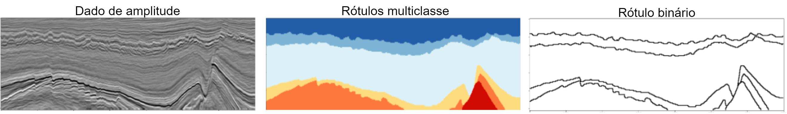

# Identificação de horizontes em sísmica usando rede neural convolucional
Projeto sobre Segmentação Binária de Horizontes em Imagens Sísmicas.

## Resumo
O petróleo e gás são importantes na economia mundial, utilizados como matéria-prima em vários produtos. Para a extração desses produtos é necessário realizar a caracterização dos reservatórios de hidrocarbonetos. A partir dessa caracterização são extraídos um volume com dados sísmicos da região de interesse. Esses dados são interpretados para identificação de várias características, como a classificação de fácies sísmicas, horizontes, falhas, gás. A grande quantidade de dados do volume de sísmica, torna a interpretação manual cada vez mais desafiadora. Muitos pesquisadores da área de interpretação sísmica tem investido em métodos utilizando redes neurais. As redes neurais convolucionais (CNN) são muito utilizadas em problemas de visão computacional, e obtém ótimos resultados em muitos problemas com dados 2D. O presente trabalho tem como objetivo a aplicação de redes neurais convolucionais no mapeamento supervisionado de horizontes sísmicos. Avaliamos nossa proposta usando o bloco F3 com as anotações de fácies sísmicas. Os dados foram utilizados baseados em modelo de seção e patches. Na previsão de horizonte foram avaliadas as arquiteturas da ResUnet e DC-Unet. Como função de perda foram analisadas a Generalized Dice e a perda Focal Tversky. O método mostrou resultados promissores com a ResUnet e função de perda Focal Tversky, nos dados baseados em patches de 128x128, alcançando aproximadamente 56% na métrica Dice.

## Conjunto de dados
O conjunto de dados utilizado neste trabalho foi o bloco F3 da Holanda. Este é um modelo geológico 3D, que foi anotado por [Alaudah et al.](https://github.com/yalaudah/facies_classification_benchmark), que definiu os dados em seis classes. O volume desses dados é composto por inline e crossline. A Tabela abaixo mostra a divisão desses dados em três conjuntos e a quantidade de inlines e crosslines.

|   Base   | Crossline |  Inline  |
| ---------| --------- | -------- |
| Treino   |    701    |    401   |
| Teste 1  |    701    |    200   |
| Teste 2  |    200    |    601   |

### Adaptação das anotações

As anotações dos rótulos deste conjunto de dados consideram um problema multiclasse, onde são divididas em 6 fácies sísmicas. Os horizonte são as fronteiras entre essas fácies. Como o objetivo deste trabalho é encontrar essas fronteiras consideramos o problema como binário, por isso foi necessário adaptar as anotações dos rótulos. Nas imagens definimos o rótulo de background com valor 0 e os horizontes com valor 1.  Para visualização dos resultados neste trabalho o background é representado pela cor branca e os horizontes pela cor preta. Nas imagens abaixos temos um exemplo da adaptação das anotações.



## Etapas da Solução
O método proposto está estruturado em duas etapas: pré-processamento e segmentação.
Neste trabalho foi utilizado modelos baseados em Seção e baseado em patches. Nas imagens abaixo podemos observar o fluxograma dos processos, para o modelo em seção e para o de patches.

Modelo baseado em Seção:


Modelo baseado em Patches:


## Implementação
Para a reprodutibilidade da pesquisa seguem as seguintes etapas.

### 1 Pré-requisitos:
Instalação dos seguintes pré-requisitos: 

```
pip install -r requirements.txt
```

### 2 Conjunto de dados:
Baixar o conjunto de dados de [Alaudah et al.](https://github.com/yalaudah/facies_classification_benchmark)

### 3 Geração da base de treino
Se a base ainda não foi pré-processada defina as configurações no arquivo [config.py](https://github.com/yalaudah/facies_classification_benchmark). Em seguida, execute o comando: 
```
python generateDataset.py
```

### 4 Treinamento:
Defina as configurações no arquivo [config.py](https://github.com/yalaudah/facies_classification_benchmark). Em seguida, execute o comando:
```
python main_train.py
```

### 5 Inferência:
Se modelo baseado em Seção, defina no arquivo [main_test.py](https://github.com/yalaudah/facies_classification_benchmark) o caminho da pasta de treinamento. Em seguida, execute o comando:
```
python main_test.py
```
Se modelo baseado em Patches, defina no arquivo [main_testPatche.py](https://github.com/yalaudah/facies_classification_benchmark) o caminho da pasta de treinamento. Em seguida, execute o comando:
```
python main_testPatche.py
```

